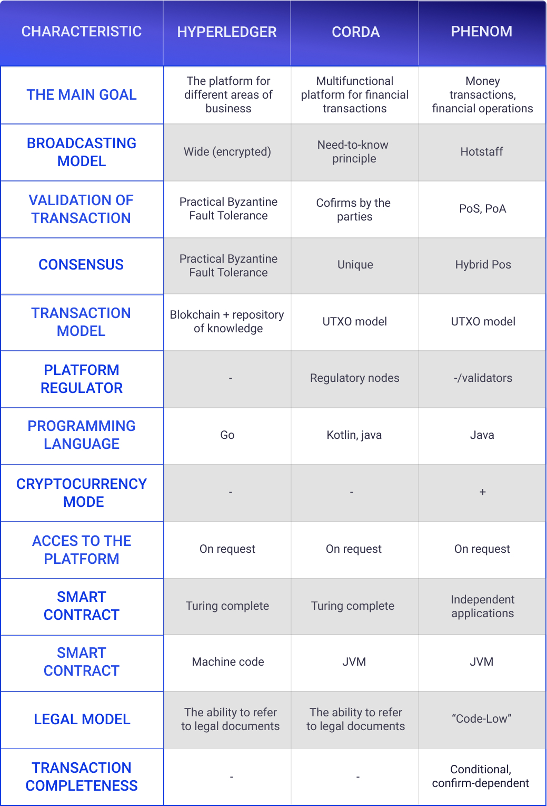

# White Paper v1.0 <!-- {docsify-ignore} -->
 
# Introduction :id=intro

The world economy has been undergoing global changes over the past three years. The pandemic is only accelerating those processes which, according to forecasts of economists and futurologists, would otherwise take more than 10 years. We are talking about the rapid digitalization of the vast majority of economic processes. Production is being digitized, as is consumption. What does it mean? That today we not only create, produce and sell with the help of technologies, but also buy and use various services and products through them. Their integration into our lives leads to the transformation of technologies from auxiliary and additional services into products themselves. The Internet of Things, Machine Learning, Cloud Computing, and many other trends support this thesis.

Where is this process leading? To fundamental changes in the economic structure. If in the past the largest sectors of the economy were mining of valuable minerals, agriculture and manufacturing, now information technology is driving these sectors out of the economic Olympus. This is reflected both in the global growth of the IT industry and in the large-scale development of related areas. New economic models are emerging as a result of a strengthened productive connection between humans and technology.

In the past the main ways of making money were the production, purchase and sale of goods. Today, partially thanks to technology, there are new ways to monetize human energy. These changes can be feared, or benefited from. Chances are you have already repeatedly pondered about how to make technologies work for you instead of working for technologies. If so, you belong to flexible, adaptive, and proactive people. It is for such people that we have created and are developing the Phenom Ecosystem.

Researchers studying the emergence and development of digital ecosystems agree that an ecosystem is born when a user ceases to be a user and becomes a co-creator. It was the idea of ​​making technology useful and valuable to people that drove us to conceive and implement our unique digital ecosystem.

What is a digital ecosystem? It is an autonomous complex of technical solutions and products, combined into a single entity, that meet various user needs and are available for use both as a complex and separately.

The classic ecosystems known worldwide are Google, Yandex, Facebook, Apple. These ecosystems typically began their life with one product or service, and after that grew into industry giants. For example, Facebook started out as a small student forum, then became the first social network to reach over 1 billion users, and then a transnational ecosystem. However, this growth was not initially programmed. Today, the giant company is guided by that same goal as decades ago - to benefit the owners. At the same time, there is no talk about tangible value and real benefits for the participants of the system.

We created the Phenom Ecosystem to shift the balance of benefits towards reciprocity, towards the user. Our financial model is built on what is most beneficial to the users of the ecosystem. We have programmed the Phenom development model so that ecosystem growth is possible only when it is beneficial and valuable to its users. We are driven by the desire for greater justice for everyone. For more than three years now, we have been persistently, consistently and with inspiration manifesting our intentions into reality.

The Phenom Ecosystem is not just a collection of technological solutions, services, software and hardware products. It is something entirely different and completely new in the information technology market. Phenom is a new approach; it is a free space that combines business, technology, entertainment, science and communication. A transparent economy, a stimulus for development and work, motivation for new research and discoveries - these are all fundamental principles of Phenom. This is an ecosystem, the consistent development of which directly depends on the development of users and the community as a whole.

## Project history :id=history

48.33% of the world's population, 3.9 billion people to be exact, own smartphones in 2021. We simultaneously use them as an alarm clock, a directory, a communication tool, a work tool, and even as a way to get distracted and relax. A smartphone provides instant communication with our loved ones, and opens the door to any, even the most remote part of the world.

The numerous functions of modern mobile devices lead to the fact that today everyone who owns a smartphone can no longer imagine what life would be like without it.
According to statistics from 2021, on average, people check their smartphones 60 to 300 times a day. However, despite the regular interaction with a mobile device, the daily average time that we spend with a smartphone in our hands is about 3 hours and 20 minutes.

Smartphones are becoming more and more integrated into our lives. When in 2017 the founders of Phenom came up with the idea to connect high technologies, smart mobile devices and ambitious and motivated people into a single and effective network - smartphones had not yet had such a global popularity. The numbers won't lie: there were 1 billion fewer smartphone owners in the world in 2017 than there are now.

The founders of Phenom were convinced that in the near future, the number of portable, high-precision and multifunctional devices would increase. This would be especially noticeable not so much in quantitative but in qualitative way.

We created the Phenom Ecosystem specifically for smartphones, not laptops or computers, for several reasons.
We were attracted by:

* Extensive development opportunities
* A combination of innovative technology and ease of use
* Independence and autonomy of devices
* Functionality
* Accessibility for everyone

## Phenom ecosystem concept :id=concept

In every successful idea there is not only a hidden opportunity, but also a global problem that awaits a solution. The problem that puzzled our team was the instability and high risks that
were present in modern fund storage systems. At the same time, we were concerned about the inability of existing digital ecosystems to respond to all the needs of their users and provide material feedback in the form of rewards. Market analysis, tests and surveys confirmed our hypotheses and showed that users are indeed in need of a convenient and reliable decentralized and autonomous system that could provide both professional functions and hardware capabilities of the network.

In response to this demand, we created a solution that could neutralize the disadvantages of classical ecosystems and take advantage of the benefits of new technologies. Our goal is ambitious: to create a whole range of products, services and technical solutions, within which it will become easier for people to manage their resources, the effectiveness of which will increase significantly. Thus, our concept was to create a platform united by common values ​​and views and based on the possibilities opened up by a smartphone. We have combined the solution to these two global problems and needs into one solution. This is how the Phenom Ecosystem was born.

The concept of our ecosystem, unlike other similar systems, for example, Google or Facebook, is that at the center of it is a person. We do not exploit human resources for our own benefit, but on the contrary, we help people to freely and independently utilize their resources, while maximizing the benefits.

For example, the Microsoft ecosystem offers users a multifunctional software that makes it easier to use technology and allows them to work with documents and presentations more efficiently. However, the immediate goal of the Microsoft ecosystem is to maximize the income gained from the sales of its technology.

The ecosystem of services from Facebook offers users a space for communication, self-expression and business development, but the dark side of this ecosystem is that without an advertising account, the user will not be able to develop and achieve their goals. And every user movement within the Facebook ecosystem is recorded by an algorithm, which is subsequently used to set up advertisements in the Advertising Account or even passed on to third parties.

Within the Phenom Ecosystem, each user can find tools for learning, relaxing, improving their efficiency and finding like-minded people. And all this for their own benefit and in absolute safety.

The key difference in the Phenom Ecosystem is that at the core of its functioning is not only profit maximization, but also satisfaction of the needs of the user, who, within the ecosystem, is not only a user and a manufacturer, but at the same time a co-founder, a beneficiary, and a promoter.

# Phenom Ecosystem :id=eco

The digital ecosystem belongs to one of the trends of the modern world. Six of the top seven companies in the world are built on the ecosystem principle. What is it and why are the leaders of the information technology market striving to organize their products, services and technical solutions in the format of an ecosystem?

A digital ecosystem is a decentralized, adaptive, distributed and open system of digital products, the organization of which is inspired by the functioning of natural ecosystems.

The Phenom Ecosystem is a unique new high-tech digital space in which services, products and solutions are organized around the user's needs. The principles on which the Phenom Ecosystem is built are very different from those generally accepted in the world of ecosystems. We are committed to the values ​​of transparency, mutual benefit, security and decentralization. A few words about each of them:

* Transparency - thanks to blockchain technology, namely the Blockchain Explorer tool, users can control absolutely all processes that occur within the ecosystem.
* Mutual benefit - absolutely every member of the ecosystem benefits from participation in it. The amount of benefit received within the ecosystem is directly proportional to the contributions of each participant to its development.
* Security means that your funds and personal data remain safe.
* Decentralization means that all products are created on the basis of a decentralized network, which is created by the users themselves.

Classic decentralized systems use special hardware and software with a colossal computing power. This is how decentralization is achieved. However, if we plunge into the issue more deeply, we will see that all these capacities are concentrated in the hands of a few pools, and decentralization is being manifested, but not actually achieved. After all, if the majority of the pools that own popular cryptocurrencies make a deal with each other, then all the benefits of decentralization will evaporate very quickly. And that's a pretty realistic and achievable scenario.

This is why it is so important that any device can become a node, even your old smartphone or new iPhone. Decentralization is such a concept where quantity plays a key role. And it is the quantity that makes Phenom such a powerful system with the highest level of decentralization that can only be achieved with the current level of development of digital technologies.

A key component of our technology is the digital node deployed in the operating system of the device. After a long optimization and writing dozens of services, the system was tested and is ready to use.

In 2021, the following products have already been developed and are operating in the Phenom Ecosystem: Phenom Network, Phenom Chain, Phenom Token, Phenom App, and Phenom League. In the near future, the world will see a number of developments that will combine all products and solutions into a single system, namely the Phenom Pay payment system, the Phenom Exchange internal exchange, the Phenom OS operating system, the Phenom Phone branded smartphone and the Phenom MarketPlace.

## Phenom Network :id=network

New realities dictate new needs. Along with the rapid integration of technology into everyday life and business, users need even greater privacy and decentralization that will ensure communication, interaction and development of everyone, without intermediaries and hierarchies.

The Internet, created as a space of complete freedom, is becoming more and more censored. In response to this problem, we created our own solution - the Phenom Network, a decentralized network.

The Phenom Network is the foundational network that is created by the ecosystem users and their smartphones. It embodies the classic understanding of the digital network, that is, the virtual space, the participants of which are linked by common values, principles and aspirations.

The mission of the ecosystem is to become a space for meeting, communication and cooperation of ambitious, purposeful, motivated and open to new technologies people. The Phenom Network is the foundation for achieving this goal.

It is thanks to the Phenom Network that ecosystem users can achieve the main goal - to acquire as many tokens as possible, as well as jointly develop products, participate in LEAGUE matches and tournaments, communicate with their teams in the Phenom Metaverse, etc. The number of options for joint activities will only increase with the development of the ecosystem.

## Phenom Chain :id=chain

If earlier blockchain technology was associated mainly with bitcoin, now the number of areas of use of blockchain has increased tenfold and is no longer limited exclusively to cryptocurrencies. Due to the confidentiality of data storage and the impossibility of hacking, blockchain is already used today for storing medical data, managing the Internet of Things, secure personal identification of users, and even in the sphere of sale and rental of real estate. Blockchain is a tool of the future that is already changing our lives.

Blockchain provides transparent, reliable, simple and fast storage and processing of data. Data is written to the blockchain in a few seconds and is not stored in one place, but simultaneously by all participants in the chain. The chain consists of blocks that are connected one by one. Each block contains information about the previous block. That is why the data cannot be hacked, stolen or forged, and any attempt to change the information will be restored from the copies of other participants.

### Principle characteristics

* Blockchain type: **Private**
* Transaction model: **UTXO**
* Programming language: **Java**
* Virtual Machine: **JVM**
* Transaction validation: **POS, POA**
* Consensus algorithm: **Hybrid POS**
* Total issue: **100,000,000 PNT**
* Initial issue **30,000,000 PNT**
* Issue of cycle initialization: **70,000,000 PNT**

------

**Phenom Chain** is a private, distributed and autonomous database that unites all information and reports on user actions in the ecosystem in the form of a sequential chain of events on different information carriers, namely smartphones. The main goal of Phenom Chain within the ecosystem is to ensure the implementation of the principle of decentralization, security and transparency.

Unlike public or government blockchains, a private Phenom Chain can provide higher efficiency, faster development speed, complete privacy and stability. More details about each item below.

* *High efficiency* is achieved by the fact that in a private blockchain it is impossible to overload the server, while in a public one, after a wave of media popularity, it is easy.

* *Higher speed* than in public blockchains allows us to be more efficient in making decisions, implementing the necessary changes and developing rapidly.

* *Full confidentiality* is achieved thanks to the very architecture of the private ecosystem.
 
* *Stability* is due to the fact that a private blockchain system cannot crash: neither technically nor in value. After all, only trusted people are allowed into it. This is why we attract new community members through referral programs, and not through mass advertising.

In addition, the maintenance and technical support of a private blockchain is more economical than that of a public one, which means that participation in it is more beneficial for the community members themselves. An important point: since the private blockchain requires user authentication, there is no way for fraudsters to penetrate the ecosystem.

Let's turn to the principle by which the Phenom Chain is built: all blocks in the chain are identified by hashes. The hash, in turn, is generated using the SHA256 algorithm. Each block refers to the previous block, that is, each block in its hash contains the hash of the previous block. A sequence of hashes linking each block to its previous block creates a chain that stretches all the way to the very first block. In such a structure, faking something will not go unnoticed. As soon as something is changed in it, all subsequent hashes become invalid.

### Transaction Validation and Consensus Algorithm

**Validation** is the process of checking transactions and blocks for compliance with the conditions under which an operation can be performed. If a node reveals that certain conditions had been violated at the time of the transaction, the transaction will not be executed.

Validation in the ecosystem takes place according to the PoS principle, where the share size (Stake) is used as a resource, which determines which of the nodes will eventually find a block and receive a reward. If we simplify this scheme, then mining or extraction of new tokens occurs due to the presence of coins in the wallet, and the more of them are stored by the user, the greater his reward will be.

PoA is a protocol that allows only accredited participants to validate blocks. This is done for security reasons. The PoA consensus algorithm uses the meaning of identifiers, which means that block validators do not create coin stakes, but instead have their own reputation. Hence, PoA blockchains are protected by verifying nodes that randomly choose a trustworthy one.

The key to understanding what types of nodes are in the Phenom Chain is the fact that absolutely all nodes validate blocks. And the nodes can be technical solutions of the ecosystem and portable computing devices of users.

From a technical point of view, there are two types of nodes: light and full. However, the only difference between them is that the full nodes have the ability to form a queue of transactions and blocks - the so-called mempool. They order all transactions into a global thread for sequential execution.

Each node has its own special stak. It is constantly checked for sync status and includes all balances. The full node packs transactions into a block one by one and validates them, after which it sends the block for validation to all other nodes.

When sending a transaction, the balance on the address is checked first, and if the balance is sufficient, then the transaction goes to the pool. Then it is checked to see if it can be carried out. After that, it enters the block. If other nodes encounter an error, the transaction remains in the block, but with the "unsuccessful" status. If the validation is successful, then the block is saved. The Phenom Chain is built on this principle.

Thanks to Phenom Chain, all transactions, that is, actions and activities taking place in the ecosystem, are recorded, verified and securely stored on multiple devices.

And thanks to Blockchain Explorer, each user has full access to information about tokenomics: how many tokens are mined, how many are stored, how many are in the reserve fund, and how many tokens the user has bought and spent. Moreover, the Blockchain Explorer displays information about how many applications have been downloaded and what volume resources have been delegated. Literally every user action within the ecosystem will be recorded in the Blockchain Explorer using the Phenom Chain blockchain.

### Phenom Blockchain Technical Specifications

## Phenom Token :id=token

Since we are creating a global ecosystem, we have our own currency that does not depend on external conditions, which is created, mined, stored and sold exclusively within the ecosystem - the Phenom token or PNT.

The unique currency of the ecosystem is designed to help each member of the system to operate with maximum efficiency - particularly for the benefit of the user personally and for the benefit of the development of the ecosystem as a whole.

The Phenom token allows you to perform all the computations within the Phenom Chain, as well as create additional value during its storage, purchase and sale within the ecosystem.

All users directly affect the token rate and the ecosystem development. The more active users join the ecosystem, the higher and more stable its indicators and the growth of the token rate will be. In addition, the Staking rates affect the token rate, because the storage of the token puts an increasing pressure on the rate.

### Issue model

The ecosystem has a limited issue model, which means that there is a fixed number of tokens that will be mined and used in it over the entire life of the ecosystem.

* *Total issue* - 100,000,000 tokens. This is the optimal amount for a fast and efficient growth and development of the ecosystem.

* *Initial issue* - 30 million tokens.

* *Issue at the initialization cycle* - 70 million tokens.

Why did we choose this format? We clearly understand the size of the target audience and the percentage of the market that we can occupy. Based on this, we also calculated the optimal issue indicators. If our forecast is underestimated, nothing terrible will happen, merely the first economic cycle will drag on not for 5, but for 7 years. If our forecast turns out to be too optimistic, this will positively affect the price of the token, which will increase. And if our demand forecast is accurate to the tiniest detail, then we will get a stable and constant development of the ecosystem and the corresponding growth of the token.

We used 3 key metrics to assess the industry outlook and demand:

1. Trend indicators of the past few years.
2. Search demand metrics of the past few years.
3. Corporate data of auditing companies.

Considering our marketing resources, depending on the niche, we calculated what percentage of the market we can get.

We aimed to create a tokenomics that would be as transparent as possible. That is why absolutely every user of the ecosystem has access to constantly updated data in the Blockchain Explorer.

### Pricing Model

As we said earlier, Phenom is a digital ecosystem that is constantly evolving and becoming more complex. To make this process as stable as possible, a number of rules are needed that would keep the entire ecosystem afloat, especially at a time when deep crises are taking place in the cryptocurrency market. When calculating the size of the issue, we studied the experience of the largest companies in the fintech field. Such knowledge and technologies make it possible to achieve the most favorable and long-term conditions for the development of the project.

To avoid too high fees, the atomic unit of the token was also introduced: 1 Phenom = 1,000,000 ATOM. At the same time, the atomic particle of the token that can be transferred to the blockchain is 0.000001 PNT. This analogue also exists in bitcoins, WEI in ETH and other cryptocurrencies.

Technically, it will be implemented as follows: at the kernel level, 100,000,000,000,000 ATOMs are released, while in the documentation, API, validators, explorer, wallet and on any other side, the ATOM number displayed is divided by 1,000,000.

This will allow us to set very small commissions.

For example, after sending 500,000 ATOM, we will actually send 0.5 with PHENOM. And the relevant information will be included in the Blockchain Explorer. This approach allows both to continue working with integer values ​​at the kernel level, and to avoid errors that result from rounding.

All commissions from transactions are accumulated in a single, separate system address, which is completely transparent and viewable by any user of the ecosystem - all in that same Blockchain Explorer. Depending on the network parameters at the current time and according to the contribution of one or another mobile device to the process of confirming transactions and blocks, a reward data table is built. Rewards to participants are paid exactly from the above-mentioned system address, on which commissions for transactions are accumulated.

This pricing model is designed for 5-7 years. At the end of this cycle, the project will move on to different economic rules typical for classic cryptocurrency projects.

## Phenom App :id=app
The business card and entry point to the ecosystem is the Phenom App. Today it is available for download both from the AppStore and from GooglePlay. What is its purpose?

For Phenom technology, the mobile device is the cornerstone of decentralization. The fact that there are many devices, and they are all independent from each other and located all over the planet, makes the smartphone the most effective tool in the technology of distributed data storage and processing.

The numerous features of the Phenom App fall into three categories:

* Participation in the validation process in the Phenom Chain
* Use of the ecosystem services and products
* Interactive interaction with the ecosystem

Let's look at each one in more detail:

Participation in the validation process in the Phenom Chain is a direct manifestation of the principle of decentralization. After all, every user device registered in the ecosystem is a node that takes part in the validation of blocks in the blockchain.

By using the services and products of the ecosystem, we mean:

* Phenom token staking
* Tracking your progress and achievements in your Personal Account

As the owner of the PNT token, each user benefits from the growth of the token rate, and also unmediated and directly participates in the growth and development of the ecosystem.

By interactive interaction with the ecosystem, we mean all those actions that make the user’s experience in the ecosystem more interesting, exciting and varied, and most importantly, benefitting.

As part of this feature, users in the ecosystem can:

* Complete missions and receive valuable rewards;
* Play matches and participate in tournaments in the LEAGUE, interacting with other members of the community and also receiving rewards;
* Leverage the features of the Phenom Metaverse, which aims to build a vibrant and active community of users who can meet their needs for sharing experiences by interacting with each other within the community.

## Phenom League :id=league

Phenom LEAGUE is a unique direction within the ecosystem. In this section you can find tournaments, challenges and many other game formats. The idea of ​​LEAGUE is to give ecosystem users the opportunity to compete with each other, have fun and earn tokens.

Everyone can test their skills and compete with other users if their Phenom application is updated to the latest version, and there is at least 1 token on the balance.

The first game is already available in the application, but this is just the beginning. In future versions of LEAGUE, there will be many new formats that will be combined into a real interactive universe.

# Roadmap

## Second line products (2021-2022) :id=second

### Phenom Metaverse

Phenom Metaverse is a multiplayer virtual universe in which ecosystem participants can simultaneously be in 3D space, interact with each other, attend presentations and events, as well as receive rewards and increase their own rating. In addition, Metaverse will store a lot of information about the ecosystem, and each user will be able to create their own unique space.

Similar products are being developed in other digital ecosystems like Facebook and Google. This high-tech solution is the future of online collaboration. We have created and are improving Metaverse to help participants interact more actively and efficiently with each other, exchange multimedia data, host their own conferences and create their own databases.

### Phenom Game

Gamification of any routine processes within the ecosystem.

Phenom Game is not just an aggregator of various games or entertainment, it is a separate component with its own standards and protocols that will allow internal and external developers to gamify any routine processes. Since the main components will be the applications designed for user interaction, all digital assets such as in-game items, images, awards, etc. will be tokens with PHENOM NFT.

### Phenom Exchange

Personal exchange for fast, safe and convenient token trading.

Exchanges that are already present on the market do not meet all user needs. They are software that a limited number of people have the right to, who, accordingly, have the greatest influence on the state of the exchange. These exchanges are not stable and secure enough to be trusted.

The exchange that we are developing within the ecosystem will be high-tech and secure, like all other products in the ecosystem. Thanks to the newest liquidity aggregator on the Phenom exchange, it will be possible to use liquidity for trading not only from community users, but also to attract resources located on other exchanges. And an efficient market creation algorithm minimizes rebalancing operations, since external exchanges have proven to be unreliable, tedious KYC and requiring deposits.

### Phenom Pay

Payment system for storing, sending and using tokens.

Will carry out cryptocurrency exchange based on the Phenom exchange mechanism, which is the latest development of our team with one of the highest bandwidths in the industry. Our exchange system will confidently be able to process more than 95,000 transactions per second. Such high efficiency and productivity is due to the innovative approach to programming and technology stack.

For convenience and functionality, three wallets will function within Phenom Pay: cold, warm and hot. A few words about the key functions of each.

The hot wallet is used to withdraw funds. A warm wallet is used for deposits. A cold wallet is used to store most of the coins.

## Third line products (2022-2025) :id=third

### Phenom Phone & OS

A smartphone and a mobile operating system to work even more effectively with the digital products of the ecosystem.

Unlike conventional smartphones, Phenom Phone provides various capital raising opportunities.

Phenom OS is an innovative area of ​​blockchain use, a completely new approach to the concept of smartphone functions and capabilities. The operating system will be used as software for the Phenom mobile phone.

As part of Phenom OS, each user will have their own node, which will be stored directly on their phone, thanks to which the OS will have a wide progressive ultra-fast functionality. In addition, the user will receive a commission for all transactions that take place through the user’s system.

The basis of this shell is Android with a modern minimalistic design, which guarantees the speed and stability of the OS. The main functions of Phenom OS will be embedded applications that, together with their own node, make up the entire token circulation system: Phenom App, Phenom Explorer, Phenom Wallet, Phenom Wiki, Phenom Exchange, Phenom Bot, Phenom/NFT Smart Contracts, Phenom Game.

### Phenom Browser

Despite the fact that today there are dozens of popular and convenient browsers, none of them can provide users with privacy and data security.

After analyzing user requests, Phenom is developing its browser, which is more secure thanks to the integrated DRT (Dynamic Route Technology). It will have a number of advantages over its counterparts on the market:

* Convenient synchronization with the Phenom Ecosystem.
* Fast work. The browser opens quickly, and new tabs and page content load quickly as well.
* Stability. On Phenom, the browser rarely freezes and crashes.
* Availability of a universal search box. The address bar is combined with the search bar.
* Automatic translation of text, thanks to the translator built into the browser.

Privacy will be a key feature of the Phenom browser. With Dynamic Route Technology, you can:

* Consume content while maintaining a high speed, bypassing the restrictions of your internet provider.
* Play online games without fear of slowdown from your own provider.
* Avoid eavesdropping, phishing and other scams thanks to a hidden location.

### Phenom Messenger

The Phenom messenger is a secure messaging, file and token exchange system based on the Phenom Chain and has a number of advantages over the classic P2P messenger.

Key advantages of Phenom Messenger in the blockchain:

* One click to create an account, no phones or emails, no need to access address books and geolocation.
* IP addresses of users are not available to each other, and all messages are encrypted with Poly1305.
* Cannot be censored, accounts cannot be locked, and messages cannot be deleted.